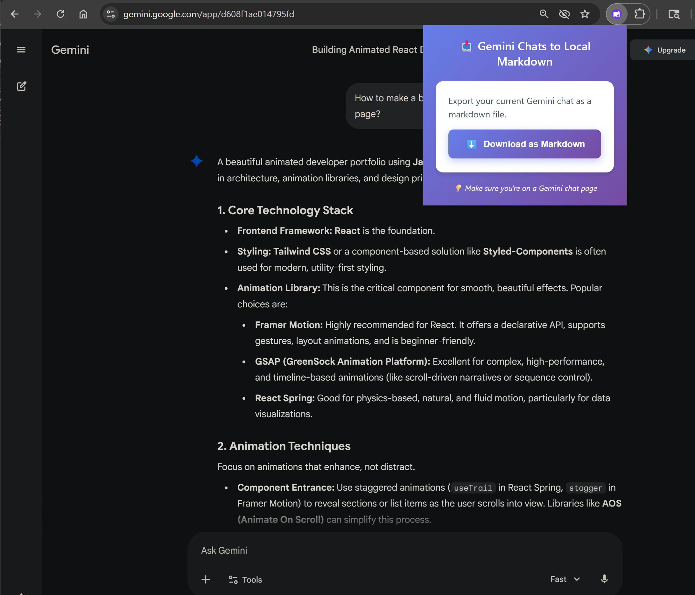

# Gemini Chat to Local Markdown Files

A Chrome extension that allows you to download your Google Gemini chat conversations as markdown files, perfect for importing into Obsidian, Notion, or any other markdown-based note-taking application.

## Features

- **One-Click Download**: Export your Gemini conversations with a single click
- **Clean Markdown Format**: Conversations are formatted with proper headings, code blocks, and formatting
- **Organized Output**: Each chat is saved with a descriptive filename based on the conversation title or timestamp
- **Privacy First**: All processing happens locally in your browser - no data is sent to external servers

## Installation

### From Chrome Web Store
*(Coming soon)*

### Manual Installation
1. Download or clone this repository
2. Open Chrome and navigate to `chrome://extensions/`
3. Enable "Developer mode" in the top right corner
4. Click "Load unpacked"
5. Select the extension directory

## Usage

1. Navigate to [Google Gemini](https://gemini.google.com/)
2. Open any chat conversation
3. Click the extension icon in your browser toolbar
4. Click "Download as Markdown"
5. The chat will be saved to your default downloads folder

## Markdown Format

The exported markdown file (maybe?) includes:

- **Title**: The conversation title or first prompt
- **Timestamp**: When the conversation took place
- **Messages**: Alternating user and AI responses with proper formatting
- **Code Blocks**: Syntax-highlighted code blocks with language tags
- **Lists and Tables**: Preserved formatting for structured content

## Obsidian Integration

The exported markdown files _should_ work seamlessly with Obsidian:

1. Save the downloaded `.md` file to your Obsidian vault
2. Open the file in Obsidian - all formatting will be preserved
3. Use Obsidian's features like tagging, linking, and search with your Gemini conversations

## Permissions

This extension requires the following permissions:

- **activeTab**: To access the current Gemini chat page
- **downloads**: To save the markdown file to your computer

## Privacy

- No data is collected or transmitted
- All processing happens locally in your browser
- No analytics or tracking
- Open source for full transparency

## Known Limitations

- Only works with Google Gemini (not other AI chat platforms)
- Requires an active internet connection to access Gemini
- Some complex formatting may not be perfectly preserved

## Troubleshooting

**Q: The extension icon is grayed out**  
A: Make sure you're on a Google Gemini chat page (gemini.google.com)

**Q: The download doesn't start**  
A: Check that your browser has permission to download files and that you're not blocking downloads

**Q: Formatting looks wrong in the markdown file**  
A: Try opening the file in a different markdown viewer. Different applications may render markdown slightly differently.

## License

AGPL-3

Made with ❤️ for the note-taking community
